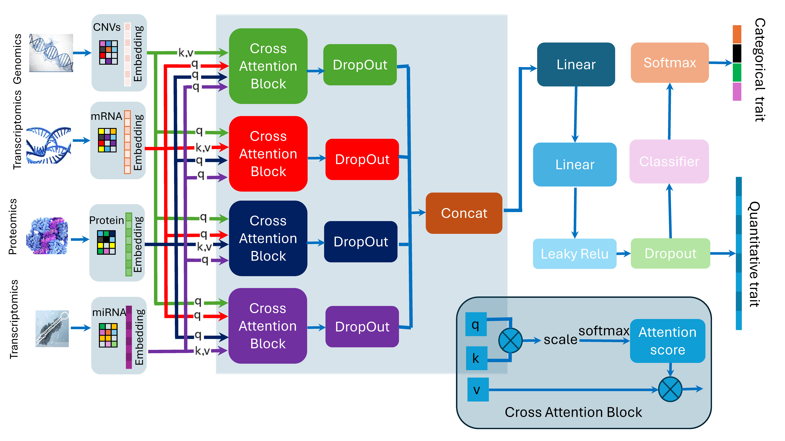

## OmicsTransformerFusion
OmicsTransformerFusion is a deep learning framework designed for multi-omics data integration and cancer subtype identification. By leveraging modality-specific Transformer encoders and advanced fusion techniques, the model captures both intra-modality features and inter-modality correlations across large-scale genomic datasets.

## Core Features
Multi-Modal Integration: Supports four distinct omics layers:

mRNA expression

miRNA expression

DNA methylation

Copy Number Variation (CNV)

Transformer-Based Architecture: Utilizes self-attention mechanisms to extract complex patterns within individual omics modalities.

Supervised Contrastive Learning (SCL): Employs cross-omics SCL to align representations across different modalities, ensuring the model learns shared biological signals.

Gated Multi-Modal Fusion: Implements a gating mechanism to adaptively weigh the contribution of each modality during the fusion process.

Deep Embedded Clustering (DEC): Integrates clustering directly into the pipeline for high-resolution subtype discovery and cancer type prediction.

## Methodology
The framework follows a sophisticated pipeline to transition from raw genomic data to clinical insights:

Feature Extraction: Modality-specific Transformer encoders process high-dimensional omics data.

Cross-Omics Alignment: Supervised contrastive learning pulls related samples from different modalities closer in the latent space.

Fusion Layer: A gated fusion network merges the representations while filtering noise.

Downstream Tasks: The fused embeddings are used for both supervised classification (cancer type prediction) and unsupervised clustering (subtype identification).

## Data Sources
### Primary Development: Validated using TCGA (The Cancer Genome Atlas) pan-cancer datasets.

### Ongoing Research: Integration and analysis of JHS (Jackson Heart Study) data from the TOPMed program are currently in progress.

## Getting Started
### Prerequisites
Python 3.8+

PyTorch

NumPy/Pandas

Scikit-learn

### Installation
Bash
git clone https://github.com/[Your-Username]/OmicsTransformerFusion.git
cd OmicsTransformerFusion
pip install -r requirements.txt
## License
This project is licensed under the MIT License - see the LICENSE file for details.
